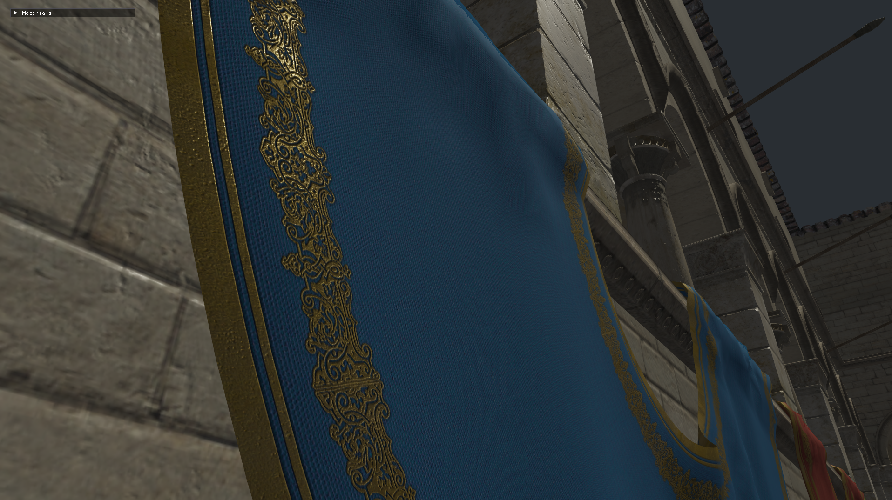

# Jalapeno

`Jalapeno` is a render engine built on OpenGL from scratch. It is in very early development stage, still a lot to do.
It’s designed for experiments and real-time graphics research.

## Features

- **Forward Pipeline**
  - At the moment only a simple forward pass has been implemented
  
- **Assimp Models and Materials Import**
  - Support for loading any model supported by Assimp library.
  - Only basic Materials are supported now, with asssociated textures.

- **Anti-Aliasing**
  - Configurable MSAA

## Screenshots

## Controls
| Key        | Action                   |
|------      |--------------------------|
| WASD       | Move                     |
| Alt + LMB  | Camera rotation          |

## Folder structure

- `include/` - Header files
- `src/` - Source files
- `shaders/` - Shaders
- `textures/` - Textures
- `models/` - Models
- `third_party/` - External libraries
