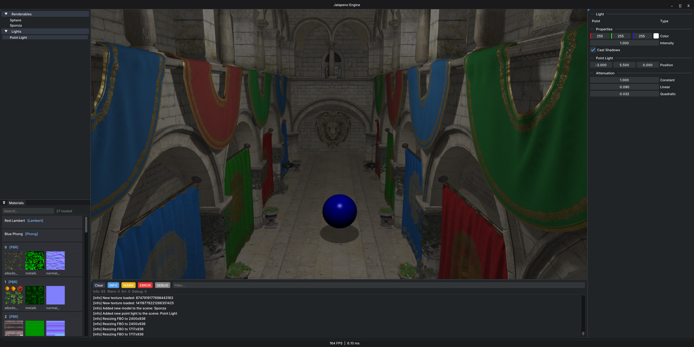
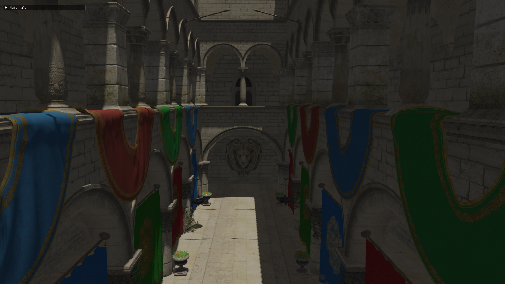
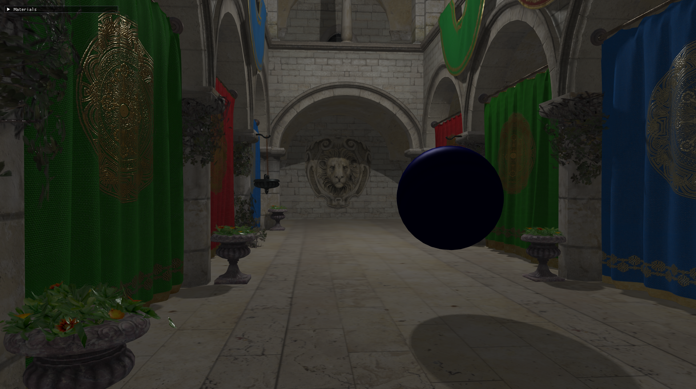
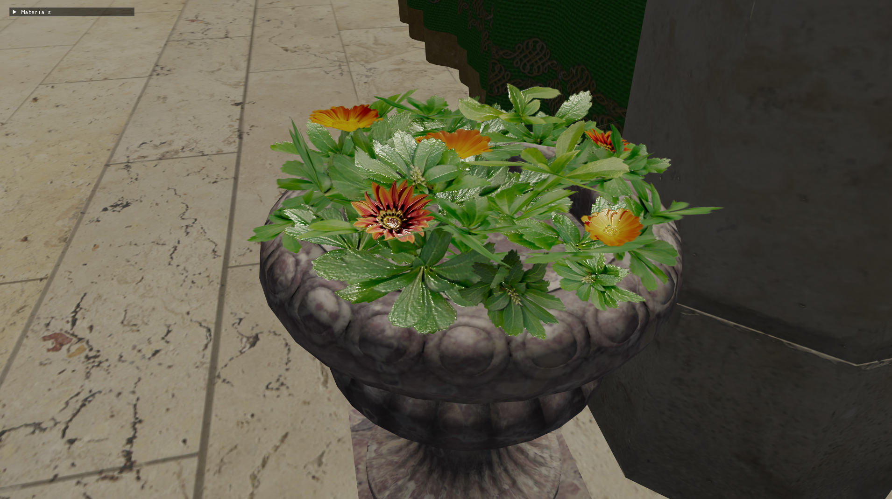

# Jalapeno

`Jalapeno` is a real-time render engine built on OpenGL from scratch, designed for graphics experiments and research.

## Features

### Rendering Pipeline
- Forward rendering pipeline with configurable render passes
- Render passes: Shadow, Geometry and Skybox
- Configurable MSAA

### Skybox & Environment
- HDR skybox from equirectangular images
- Equirectangular-to-cubemap conversion pass

### Lighting & Shadows
- Directional lights with PCF shadow mapping
- Point lights with omnidirectional shadow mapping
- Support for multiple lights (up to 2 directional, 4 point lights) via Uniform Buffer Objects (UBOs)

### Materials
- Lambert (diffuse only)
- Phong (diffuse + specular)
- PBR Metallic-Roughness
  - Cook-Torrance BRDF (GGX NDF, Smith geometry, Schlick Fresnel)
  - Albedo, metallic-roughness and normal map textures
  - ACES tone mapping + gamma correction

### Model & Geometry Support
- Load any model format supported by Assimp (glTF, OBJ, FBX, etc.)
- Built-in primitives: Sphere, Cube, Quad

### User Interface
- Custom dark-themed ImGui interface
- Hierarchy panel — scene objects list with selection
- Materials panel — all loaded materials and their textures, with selection
- Properties panel — transform and material editing for selected object
- Console panel — live spdlog output
- Render Settings panel — MSAA, skybox toggle, wireframe, VSync

### Architecture
- Singleton resource managers: ShaderManager, TextureManager, FramebufferManager, MaterialManager, BufferManager
- Smart pointer ownership throughout (std::unique_ptr for all managed resources)

## Screenshots

## Dependencies

| Library  | Purpose                        |
|----------|--------------------------------|
| OpenGL 4.6 | Graphics API                 |
| GLFW     | Window and input               |
| GLAD     | OpenGL function loader         |
| GLM      | Math (vectors, matrices)       |
| Assimp   | Model loading                  |
| ImGui    | User interface                 |
| spdlog   | Logging                        |
| stb_image | Texture and HDR loading       |
